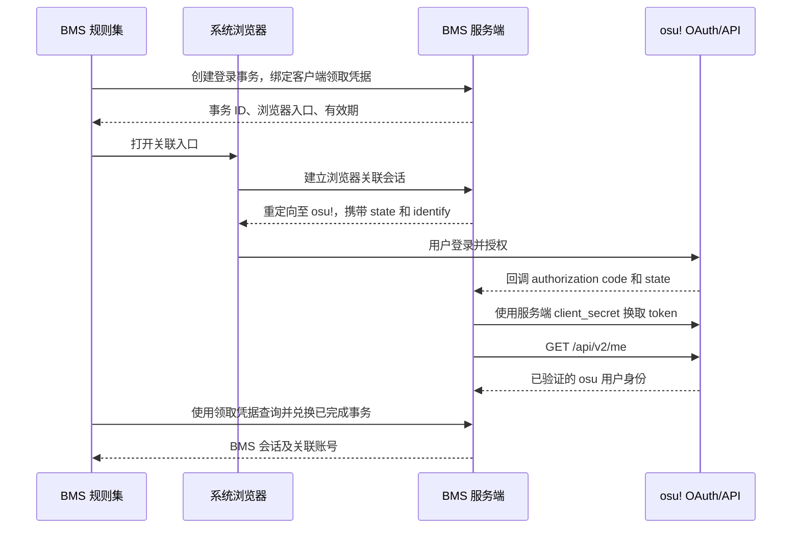

# BMS 在线成绩榜单计划

[返回开发文档](development.md)

日期：2026-09-09。状态：设计草案，尚未实现。

本文记录已经确定的产品方向、建议的首版范围和后续实施顺序。本次只编写计划，不创建服务端项目、不修改规则集逻辑、不注册 OAuth 应用，也不部署服务。

## 已确定的方向

| 项目 | 决定 |
| --- | --- |
| 身份 | 注册独立的 osu! OAuth 应用，通过 Authorization Code Grant 关联 osu! 账号，仅申请 `identify`。 |
| 登录体验 | 首次打开浏览器完成登录／授权；关联成功后自动维护会话，日常提交无需重复授权。 |
| 上传内容 | 上传完整回放及恢复成绩所需的元数据，不仅上传分数或判定汇总。 |
| 存储 | 使用 SQLite，压缩回放直接保存为独立表中的 BLOB。 |
| 谱面 | 服务器不保存、下载或分发谱面文件、音频、图片、视频；只记录哈希及必要元数据。 |
| 榜单归属 | 建立 BMS 自有榜单，不向 osu! 官方成绩接口提交，不复用其谱面或成绩在线 ID。 |
| 当前工作 | 先完成可评审的计划，后续另行实施。 |

## 建议的首版范围

首版支持原生 BMS 单曲的在线 EX 榜、个人最佳 EX、最佳灯、成绩详情和完整回放下载。公开榜单允许匿名读取；上传、个人上传状态和账号操作需要 BMS 会话。

以下为建议默认值，尚非已实现行为：

- 关联账号并开启上传后，自动上传此后的单曲游玩；不自动批量补传历史成绩。
- 保存有效游玩记录及完整回放，分别标记正常完成、完成但未过关、提前失败和主动退出。
- 主 EX 榜先收录正常完成及完成但未过关的合格记录；提前失败和主动退出保留在个人记录中。
- Autoplay、回放观看、编辑器测试和练习模式不进入上传队列。暂停、辅助和特殊 Mods 按显式策略处理，不靠一个通用布尔属性判断。
- 段位／课程榜、课程中继承血量的单曲成绩、外来谱面转换榜、好友榜和综合能力排名暂不纳入首版。协议保留游玩上下文字段，防止课程成绩混入普通单曲榜。
- 不增加游玩前领取凭据的强制步骤，支持账号已关联时离线游玩、恢复联网后重试上传。

服务端建议采用 ASP.NET Core、`Microsoft.Data.Sqlite` 和显式数据库迁移。具体服务端运行时使用实施时仍受支持的 LTS 版本；协议层保持与现有规则集运行时兼容。该技术选择为建议，用户已确定的是 SQLite。

## 当前代码基础与接入位置

| 代码 | 已有能力／实施注意事项 |
| --- | --- |
| [BmsReplayArchive](../osu.Game.Rulesets.BmsRuleset/Replays/BmsReplayArchive.cs) | 当前格式版本为 3，GZip 压缩 JSON，包含输入帧、判定事件和血条历史；旧数据允许纯 JSON。它不序列化完整 `ScoreInfo`。 |
| [BmsReplayFrame](../osu.Game.Rulesets.BmsRuleset/Replays/BmsReplayFrame.cs) | 支持动作、时间、分支记录及判定算法；存在专用的负时间分支元数据帧。 |
| [BmsBranchReplayState](../osu.Game.Rulesets.BmsRuleset/Replays/BmsBranchReplayState.cs) | 随机分支决策还会保存在成绩的系统 Mod 中，上传时不能统一丢弃系统 Mods。 |
| [BmsReplayPatcher](../osu.Game.Rulesets.BmsRuleset/Replays/BmsReplayPatcher.cs) | 本地成绩导入后附加回放文件，复制成绩时保留判定和血条附加数据。上传快照必须考虑此异步流程。 |
| [BmsSoloSongSelect](../osu.Game.Rulesets.BmsRuleset/UI/SongSelect/BmsSoloSongSelect.cs) | 普通游玩目前创建 `SoloPlayer`，可在此引入规则集自己的派生 Player。 |
| [BmsCourseGameplay](../osu.Game.Rulesets.BmsRuleset/Course/BmsCourseGameplay.cs) | 课程使用独立的 `BmsCoursePlayer`；不能因其继承 `SoloPlayer` 而自动纳入单曲上传。 |
| [BmsScoreProcessor](../osu.Game.Rulesets.BmsRuleset/Scoring/BmsScoreProcessor.cs) | 生成判定及成绩，最终 Mods 可能包含自动血条归属和暂停标记。`PopulateScore()` 不是一次性联网提交点。 |
| [BmsExScore](../osu.Game.Rulesets.BmsRuleset/Scoring/BmsExScore.cs) | EX 为 `2 × Perfect + Great`，计分事件与逐条时间观测不是一对一关系。 |
| [BmsFileImporter](../osu.Game.Rulesets.BmsRuleset/IO/Import/BmsFileImporter.cs) | 原生 BMS 的 `BeatmapInfo.Hash` 保存原始文件 SHA-256，`MD5Hash` 用于难度表兼容。 |
| [BmsBeatmapLeaderboardWedge](../osu.Game.Rulesets.BmsRuleset/UI/SongSelect/Components/BmsBeatmapLeaderboardWedge.cs) | 已有本地查询和成绩行展示，非本地范围目前走 osu! 的 leaderboard manager，需要新增自有数据源。 |
| [BmsLeaderboardScore](../osu.Game.Rulesets.BmsRuleset/UI/SongSelect/Components/BmsLeaderboardScore.cs) | 可复用外观，但在线成绩的下载、链接、选中和回放动作需要独立适配。 |

服务端不直接引用整个游戏程序集，也不反序列化 Realm 实体。新增独立、版本化的 DTO 和纯数据校验代码；需要共享的逻辑应从本仓库提取，不能依赖游戏窗口、音频或本地谱面运行。

所有实现只发生在本仓库。`../osu`、`../osu-framework` 和 `../rulesets` 仅作为只读 API 参考。

## OAuth 认证与会话

### 首次授权的边界

lazer 的 `IAPIProvider` 能提供登录状态、用户资料和现有 access token，但这不等于用户已经授权 BMS 自有 OAuth 应用。

当前 osu-web 的 `/oauth/authorize` 使用网页 Session 认证，授权提交经过 Cookie／CSRF 流程。现有 lazer Bearer token 不能直接替代网页会话；公开支持的流程中没有将它交换成另一个 `client_id` 的授权 token 的 Token Exchange。lazer 的 refresh token 也不能作为 BMS OAuth 应用的 refresh token。

因此本方案不读取并转发 lazer access token，不尝试自动点击授权或模拟网页会话。首次关联需要用户参与；浏览器已有 osu! 登录时可以省去输入账号密码，但不能保证首次过程完全无感。

### 首次关联流程



实现约束：

1. OAuth `client_secret` 只存在于服务器。使用固定 HTTPS 回调地址，和 osu! 应用登记值完全一致。
2. 每次登录生成不可预测、短时有效且一次性的 `state`，绑定登录事务和浏览器关联会话；回调验证后原子消费，拒绝过期或重复回调。
3. 领取凭据由客户端保管，服务器只保存其摘要，不放入浏览器 URL。事务 ID 本身不足以领取会话。可以采用客户端随机 secret 与服务端摘要绑定，不要求 osu! 支持额外 grant。
4. 浏览器回调页只显示成功或失败，不返回 BMS 长期凭据；桌面客户端通过受凭据保护的接口领取。
5. 身份只取服务器向官方 `/api/v2/me` 请求得到的 `id`。用户名用于展示，不能作为用户主键。
6. 规则集比较关联账号与当前 `IAPIProvider.LocalUser`。不一致时暂停上传并显示切换／重新关联入口。客户端提供的预期 ID 只能用于防止误绑，不能成为服务端鉴权依据。
7. 取消授权、错误账号、轮询超时和应用关闭都应收敛到明确状态，不能无限重试浏览器流程。

### 后续无感使用

- 客户端持有 BMS 自有会话，不持有 BMS OAuth 应用的 osu refresh token。
- BMS access token 采用短期不透明随机值；配套可轮换的 BMS refresh token。SQLite 保存凭据摘要、用户、到期时间、会话家族和撤销状态。
- BMS refresh token 轮换采用原子更新；检测已消费凭据被重复使用时撤销对应会话家族。客户端保存新凭据失败时回到重新关联流程。
- 服务端加密保存本应用取得的 osu refresh token，并原子更新刷新响应中的新 token。加密密钥独立于 SQLite 文件和源代码管理。
- BMS 会话续期前，按有界的身份校验缓存策略刷新／验证上游授权。osu 明确返回撤销或 `invalid_grant` 时停止续期并撤销关联会话；网络超时或 5xx 不应误判为用户撤销授权。
- 既有短期 BMS token 的有效窗口要明确；不能承诺 osu 撤销授权会立即通知本站。具体有效期和校验间隔在认证阶段配置并测试。
- 客户端监听 osu 退出／切换账号，停用当前会话并暂停其队列。离线网络状态变化不应被误当成账号切换；保留游玩开始时已经确认的关联账号快照。
- 待上传记录永久绑定创建时的关联账号，只能在同一账号恢复后提交，不在换号时重新署名。

区分“退出当前 BMS 会话”和“解除账号关联”：前者撤销当前会话；后者撤销该关联下的全部 BMS 会话、清除上游凭据，并尝试撤销本应用的 osu 授权。不要影响 lazer 自己的登录。

## 上传协议与回放恢复

### 单次上传

```http
POST /v1/scores
Authorization: Bearer <BMS access token>
Idempotency-Key: <submission_id>
Content-Type: multipart/form-data; boundary=...
```

请求只包含 `metadata` 和 `replay` 两个固定部分。`metadata` 是 UTF-8 JSON，`replay` 是现有 `BmsReplayArchive` 输出的完整压缩字节。上传层不再对回放转 Base64，也不依赖用户文件名决定存储位置。

现有内部文件名虽然是 `replay.osr`，其内容是 BMS 自定义格式，不能交给标准 osu! legacy `.osr` 解码器。

| 元数据组 | 必需信息 |
| --- | --- |
| 协议 | `protocol_version`、`replay_format_version`、`ruleset_version`、`scoring_rules_version`、`osu_version`。 |
| 提交 | `submission_id`、游玩时间、时长、结束状态、单曲／课程／练习上下文。服务端另行记录接收时间。 |
| 谱面 | 原始文件 SHA-256、可选 MD5、格式、标题、艺术家、谱面难度名、键型；使用明确定义的展示字段。 |
| 玩法 | 最终生效的 Mods 及全部回放相关设置、随机种子、`#RANDOM`／`#SWITCH` 分支、判定算法及判定参数、LN/CN/HCN 模式、实际倍速。 |
| 成绩 | 原始判定统计、声明 EX、最大 EX、计分事件总量、准确率、最大连击、完成状态、所用血条和最终灯、暂停记录。 |
| 回放 | 压缩字节长度、声明的 SHA-256；服务端按收到的实际字节重新计算，拒绝不一致。 |

不得直接把整个 `ScoreInfo`、`BeatmapInfo` 或 Realm 对象序列化上传。当前导入器会把本地目录写入 `BeatmapMetadata.Source`，必须使用字段白名单，排除本地路径、内部数据库引用、令牌和与成绩无关的配置。

回放内容和元数据是不可变的同一上传快照。生成 `submission_id` 后先持久化快照，再开始网络请求；重试复用相同 ID 和相同内容，避免重新压缩或更新日期导致请求发生变化。

### 版本与幂等

- 网络协议版本、回放格式版本、计分规则版本分别管理。单纯 UI 版本更新不应把榜单拆成新分组。
- 首版新上传只接受明确支持的协议和回放版本；内部旧回放的宽松读取行为不能直接用作网络校验策略。未知版本返回明确错误。
- 服务端按固定 DTO 解析，不启用来自请求数据的任意 .NET 类型实例化。实现前用当前序列化输出建立协议样例和兼容测试。
- 在 `(user_id, submission_id)` 上建立唯一约束。相同请求重试返回原有成绩 ID；相同 ID 对应不同内容返回 `409 submission_conflict`。
- 幂等指纹覆盖规范化元数据与完整回放哈希，规范化规则由协议定义。回放哈希只用于字节完整性和存储去重，不能作为身份或游玩真实性证明。
- BLOB 可以按压缩字节 SHA-256 去重；不同压缩结果不承诺语义去重，也不能据此认定两次游玩相同。

### 回放下载

`GET /v1/scores/{id}/replay` 返回一个带版本的完整下载包，建议为仅包含 `metadata.json` 和 `replay.osr` 的 ZIP。压缩过的回放使用存储模式打包；首版上传仍为固定 multipart，不额外接受任意 ZIP 内容。

下载包中的身份采用服务器已验证的成绩归属，摘要字段采用服务器保存的值；原始回放字节保持不变。用户资料和其他私有会话字段不进入下载包。

客户端通过 SHA-256 查找本地谱面，使用受限的 DTO 适配器恢复 `ScoreInfo`，再调用已有回放读取逻辑。下载包只读取固定条目，不按包内路径随意解压。找不到谱面时允许查看成绩和已有统计图，显示缺少谱面的状态，不向服务器请求谱面。

下载、查看和播放在线回放不会再次触发上传。在线成绩 ID 单独保存在 BMS 模型中，不写入 osu! 的 `ScoreInfo.OnlineID`。

## 不保存谱面时的校验边界

完整回放提供审查证据、统计重建和以后重新处理的基础，但输入帧、判定事件、音符描述、谱面哈希都来自客户端，不能自动视为可信。

首版服务端能够执行：

- 请求及解压大小、帧数、事件数、JSON 深度和数值范围限制；具体上限根据现有真实回放样本确定，记录为配置。
- 时间和动作合法性检查，允许格式定义的前置时间及分支元数据帧，不能简单要求所有时间非负。时间倒退、练习 seek 等情况按游玩上下文处理。
- 检查 `HasReceivedAllFrames`、记录完整性和结束状态的组合；“该次记录已接收完”不等于“整张谱面已打完”。
- 按版本对应的计分事件规则重新汇总判定和 EX，并比较元数据。Empty POOR、地雷和长条端点分别处理，不能将每条时间观测都计为一个得分音符。
- 检查 `0 <= EX <= maximum_ex`、观察到的事件量及最大连击的合理范围。提前结束的回放不能用已发生事件数量反推出整谱最大 EX。
- 检查 Mods、倍速、判定参数和分支记录的组合；有多处表示的字段必须一致，缺失重要回放设置时拒绝入榜。
- 根据血条事件、完成状态和最终 Mods 校验灯的内部一致性，保留声明值及处理结果；这不是基于可信谱面的独立血量模拟。

首版不能证明用户实际使用的谱面等于声明哈希，也不能仅靠上传的音符描述完成可信重判。保存输入回放不代表排除了脚本、伪造判定或修改客户端。不得把格式／一致性校验成功标记成“官方认证”或“已验证无作弊”。

建议区分 `validation_status` 与 `leaderboard_status`：例如一致性通过的记录仍可能因辅助、提前退出或规则版本原因只保留在个人记录中。错误协议或损坏数据不创建可见成绩。重复提交保护不会被描述为反作弊措施。

## 谱面标识、分组与排名

原生 BMS 以原始文件 SHA-256 为主标识，MD5 只作兼容查询。标题、文件名、难度名和本地数据库 ID 都不参与谱面身份判断。服务器保存的客户端谱面元数据没有权威性，不允许一次任意上传静默覆盖已有目录信息；可先保留每次提交的展示快照及元数据来源状态。

建议首版采用保守分组：

```text
谱面 SHA-256
  + 分支决策摘要
  + 键型与长条模式
  + 判定算法／判定参数
  + 倍速与影响玩法的 Mod 类别
  + 计分规则版本
```

- 分组由服务器根据已解析的字段计算，客户端提交的 category 字符串不能直接成为归属依据。
- `#RANDOM`／`#SWITCH` 决策不同，首版保守拆榜；未来只有在能够确认分支等价时才合并。
- Lane Random、Note Random 等区分算法类别；具体种子完整保存，但不默认逐种子拆榜。外观、音量和纯显示设置不拆榜。
- Auto Scratch、Hide Scratch、改变音符集的模式、变速和放宽判定必须制定明确策略，不能与标准玩法直接混排。未知 Mods 不默认视作无影响。
- 不统一删除系统 Mods；分支和暂停记录有实际含义。也不能仅按最终 Mods 的 `UserPlayable` 判断是否为自动演奏，因为 `BmsModPaused` 是游玩后加上的系统标记。
- 保存初始血条配置及最终归属，允许同一 EX 分组展示不同合法血条的灯；Auto Gauge 的灯按已实现的归属规则处理。灯的强弱序和特殊辅助灯在独立表驱动规则中定义。
- 每个分组每名用户在 EX 榜展示一次，取最佳 EX。建议相同 EX 以服务端接收时间、再以成绩 ID 确定稳定顺序，不用客户端时钟决定先后。
- 最佳 EX 与最佳灯分别引用成绩，允许来自不同次游玩；个人完整历史独立查询。
- 改变影响排名的策略时提升规则版本并提供重建个人最佳的方法，不能悄悄改变历史分组含义。

## SQLite 数据模型与事务

以下是逻辑模型，实际迁移和字段类型在实施阶段确定，不在本次创建数据库。

| 表 | 核心内容与约束 |
| --- | --- |
| `users` | `osu_user_id` 主键，用户名、头像 URL、资料更新时间。改名不产生新用户。 |
| `oauth_links` | 用户关联、加密上游凭据、凭据版本、过期／撤销状态；密钥不存数据库。 |
| `auth_attempts` | 登录事务 ID、领取凭据摘要、state／浏览器关联信息、状态、有效期及消费时间。 |
| `sessions` | BMS 会话、access／refresh 凭据摘要、用户、有效期、轮换家族及撤销信息。 |
| `charts` | SHA-256 主键、可选 MD5、格式、展示元数据及其来源状态；不含谱面文件。 |
| `replays` | 压缩字节 SHA-256 主键、BLOB、压缩／解压长度、格式版本。 |
| `scores` | 服务端成绩 ID、用户、谱面、分组、幂等 ID／指纹、回放引用、版本化元数据、可查询的成绩列、结束状态、校验／入榜状态及时间。 |
| `personal_bests` | `(user_id, chart_sha256, category_key)` 唯一；分别引用最佳 EX、最佳灯对应的成绩。 |
| `schema_migrations` | 已执行的迁移版本。 |

经常排序和筛选的 EX、用户、谱面、分组、状态、接收时间使用普通列和索引，不要求每次榜单读取解析 JSON。回放 BLOB 放在独立表，查询榜单不使用包含它的 `SELECT *`。

建议索引包括成绩幂等唯一索引、用户历史索引、谱面分组查询索引及个人最佳榜单排序索引；具体组合由实际查询和 `EXPLAIN QUERY PLAN` 验证。若在个人最佳中冗余 EX／时间用于排序，必须与引用成绩在同一事务更新。

上传处理顺序：

1. 鉴权并接收有大小上限的请求。
2. 在数据库写事务之外计算哈希、解压、解析、校验并决定分组。
3. 开启短写事务，再次检查幂等记录。
4. 写入／引用回放、插入成绩、按统一比较规则更新个人最佳，然后提交。
5. 提交成功后返回成绩 ID、入榜状态和个人最佳变化；排名是响应时的查询快照。

任何一步写入失败都回滚，不能留下有成绩无回放或最佳成绩指向错误记录的状态。并发的同一提交返回同一成绩；并发的不同提交不能导致较差成绩覆盖个人最佳。

运行约束：

- 初期部署为一个服务实例，数据库位于本地持久磁盘，开启 WAL；每个连接启用外键和合理的 busy timeout。
- WAL 允许读写并行，但仍只有一个写入者。遇到锁冲突使用有界重试；不要在写事务中等待 OAuth、上传、解压或文件传输。
- 备份使用 SQLite 一致性备份能力，不在运行时仅复制主 `.db` 文件而遗漏 WAL。备份恢复演练同时覆盖数据库和独立保存的凭据加密密钥。
- 记录数据库体积、回放平均大小、写事务耗时和锁冲突。BLOB 规模成为实际瓶颈后再评估独立文件存储；首版保持 SQLite 存储。
- 如增加成绩撤销功能，应在事务内重算受影响的个人最佳，回放只有无成绩引用后才能清理。

## API 草案

所有本站业务接口均使用 `/v1` 前缀。OAuth token 请求仅由服务器发送到固定的官方地址，绝不接受客户端指定验证 URL。

| 方法与路径 | 行为 |
| --- | --- |
| `POST /v1/auth/attempts` | 创建有时限的登录事务；绑定客户端生成的领取凭据摘要。 |
| `GET /v1/auth/osu/start` | 浏览器建立关联会话并跳转 osu! 授权页。 |
| `GET /v1/auth/osu/callback` | 验证 state、交换授权码、调用 `/me`、完成事务。 |
| `GET /v1/auth/attempts/{id}` | 使用领取凭据查询 pending／authorized／failed 状态，不暴露 token。 |
| `POST /v1/auth/attempts/{id}/exchange` | 使用领取凭据一次性领取 BMS 会话。响应丢失可重新发起关联，不重复消费同一事务。 |
| `POST /v1/auth/refresh` | 轮换 BMS 会话凭据，并按策略确认上游授权有效性。 |
| `DELETE /v1/auth/session` | 撤销当前 BMS 会话。 |
| `DELETE /v1/auth/link` | 解除当前账号关联，撤销其 BMS 会话。 |
| `POST /v1/scores` | 上传元数据和完整回放。 |
| `GET /v1/charts/{sha256}/leaderboard` | 按玩法分组获取分页榜单，返回服务端名次及是否还有下一页。 |
| `GET /v1/charts/{sha256}/personal-best` | 获取当前账号在指定分组的最佳 EX、最佳灯和名次。 |
| `GET /v1/me/scores` | 当前账号的提交历史和入榜状态。 |
| `GET /v1/scores/{id}` | 查询公开成绩详情。仅个人可见的记录需要验证所属用户。 |
| `GET /v1/scores/{id}/replay` | 下载完整包，沿用对应成绩的可见性权限。 |

分页使用稳定排序和有界页大小。明确榜单刷新期间的名次可能变化，不承诺多页请求处于同一数据库快照。客户端显示响应中的名次，不以当前页下标重新从 1 编号。

错误响应使用稳定机器码和必要参数：未关联／授权失效、账号不匹配、协议不支持、回放损坏、内容冲突、请求过大、请求频率限制、服务暂不可用等。客户端将机器码映射到本地化文案，不直接展示异常堆栈或服务端英文文本。

## 客户端实现计划

### 组件职责

建议新增以下规则集侧组件，名称可在实施时调整：

- `BmsOnlineClient`：固定服务地址、HTTP、错误映射、取消和请求超时。
- `BmsOnlineSession`：OAuth 关联、BMS 会话续期、当前账号匹配及凭据存储。
- `BmsScoreSubmissionFactory`：从最终成绩和已完成回放生成白名单 DTO 与不可变上传包。
- `BmsScoreUploadQueue`：本地持久化队列、账号隔离、重试与幂等状态。
- `BmsOnlineLeaderboardService`：在线查询、缓存、请求取消及远端成绩模型。
- `BmsOnlineReplayStore`：下载、完整性检查、谱面匹配及回放恢复。

网络协议 DTO 放在不依赖 Realm／Drawable 的独立层。服务端可以共享纯数据协议和校验规则，但不直接加载规则集 DLL 及其游戏、音视频和补丁依赖。

### 成绩完成与队列

普通单曲使用自有 Player 或明确的完成协调组件。等待最终 Mods、判定、血条归属和本地回放附件完成，再持久化上传快照；结果页不等待服务器响应。实现时验证 `BmsReplayPatcher` 的异步附加已完成，必要时在规则集内提供显式完成接口，不依赖不可证明的补丁执行次序。

不得在 `PopulateScore()`、结果页构造或历史成绩打开时发起提交。正常完成、提前失败和退出各路径需要统一归并到“一次尝试最多生成一个 submission ID”的入口。回放观看及自动生成回放不进入此入口。

队列状态建议为 `pending → uploading → uploaded`，异常分别进入 `retry_wait`、`awaiting_account` 或 `rejected`。程序关闭时正在上传的项下次按原 ID 重试；队列保存自包含字节，不依赖用户稍后可能删除的本地成绩附件。

网络超时、可重试 5xx 和 429 使用带抖动的有界退避，遵循 `Retry-After`；401 只进行有界会话刷新，失败后等待关联恢复。协议错误、损坏回放和内容冲突保留诊断状态，不无限重试。账号退出、切换或解除关联时暂停对应项，不能静默转交另一账号。

### 榜单与设置

- 为本地榜和 BMS 在线榜提供清楚的数据源选择，选中 BMS 在线时不再调用官方 leaderboard manager。
- 更新成绩查询和 UI 的数据源状态判断，不能只替换请求而继续读取旧 manager 的 `Scores`／`CurrentCriteria`。
- 复用成绩行外观，但自有成绩高亮、个人最佳匹配使用 BMS 成绩 ID 和 osu 用户 ID，不能依赖默认 `OnlineID`，否则多条未设在线 ID 的成绩可能全部匹配。
- 在线行的查看、复制链接、下载回放和本地导入分开处理，避免触发官方回放下载或误删本地文件。
- 缓存键包含谱面、分组、页及必要账号上下文；切换谱面或账号时取消旧请求，过期响应不能覆盖当前页面。
- 设置提供关联账号、关联状态、自动上传开关、待上传／失败项状态及解除关联入口。
- 所有规则集用户可见文案、单位和格式化内容使用 `BmsStrings`，同步英文基础资源和全部受支持 `.resx`。服务端机器码不直接作为 UI 文案。

## 实施阶段与验收

所有阶段尚未开始。每阶段应形成可独立评审的提交，不一次性混入服务器、游戏流程和全部 UI。

| 阶段 | 交付 | 验收重点 |
| --- | --- | --- |
| 1. 协议与样例 | 版本化 DTO、真实单曲回放样例、元数据映射、明确的 Mods／入榜规则。 | 正常、长条、分支、随机、暂停和失败记录可无损表达；不含本地路径；冻结大小限制及未知版本行为。 |
| 2. 服务端基础 | 独立服务项目、SQLite 迁移、配置和错误协议。 | 空库建库与升级可重复执行；外键、索引、回滚、备份恢复满足设计。 |
| 3. OAuth 关联 | 注册本应用、配置回调、登录事务、会话轮换、客户端关联入口。 | 用真实 osu 测试账号完成首次授权；验证错误账号、取消、state 重放、过期、撤销和续期。应用注册／部署属于后续工作。 |
| 4. 回放接收 | 有界解析、校验、幂等提交、BLOB 原子保存和下载包。 | 重复请求返回同一成绩；不同内容冲突；并发提交不损坏引用；下载字节与上传一致。 |
| 5. 客户端上传 | 单曲完成入口、最终快照、持久化队列及账号隔离。 | 断网／重启／超时后重试成功；不重复上传；不会上传回放观看、自动演奏或课程成绩。 |
| 6. 榜单和回放 UI | 在线榜、个人最佳、成绩详情、下载与本地播放、本地化。 | 每用户每组一条最佳 EX；最佳灯独立；翻页名次正确；有谱可重放、缺谱仍可看详情；快速切换无串页。 |
| 7. 发布准备 | 运维配置、上限、恢复流程和端到端验证记录。 | OAuth 密钥不进入 DLL／日志；服务重启后会话与队列按约定恢复；资源限制生效；明确社区榜单的校验边界。 |

### 测试约束与关键用例

本次文档变更不执行构建或测试。实际实现时所有测试命令都必须带 `--filter`，不运行未获授权的 benchmark，也不运行完整无过滤测试集。

已有回放回归入口示例：

```powershell
dotnet test osu.Game.Rulesets.BmsRuleset.Tests/osu.Game.Rulesets.BmsRuleset.Tests.csproj --filter "FullyQualifiedName~BmsReplayArchiveTest|FullyQualifiedName~BmsReplayFrameTest"
```

新增服务端和客户端测试按阶段使用明确的测试类／类别过滤，至少覆盖：

- **OAuth**：错误／缺失 state、一次性事务竞争、领取凭据错误、token 轮换重用、上游临时故障与真实撤销的区别。
- **协议**：未知版本、缺少系统分支信息、元数据与回放不一致、非有限数值、超大解压数据、负时间元数据帧和长条多观测。
- **SQLite**：并发幂等请求、同 ID 不同内容、两个成绩同时刷新个人最佳、事务失败无半条记录、关联数据外键及备份恢复。
- **上传队列**：响应丢失后的重试、上传中关机恢复、删除原本地成绩后仍可重试、切换账号不串号、进入历史结果页不触发上传。
- **榜单**：分支／倍速／判定模式分组、未知 Mod 拒绝入榜、最佳 EX 和灯来自不同成绩、同分稳定排序、页面变化取消旧请求。
- **回放**：下载包完整恢复、缺谱提示、随机种子和判定算法一致、未知格式明确失败、播放下载回放不产生新提交。

UI 用例按现有 visual test 方式执行并进行必要的视觉检查。性能判断先使用实际查询计划、上传大小和运行指标，不把基准测试作为默认验证步骤。

## 实施前需要确定的配置和产品规则

这些事项不阻塞计划文档，但需在对应阶段落定：

- 服务域名、部署目录、OAuth 应用所有者、正式与开发环境各自的回调及凭据。
- 标准榜允许的 Mods、暂停策略、提前失败记录的展示范围、灯的优先级及是否公开辅助分组。
- 每个已支持玩法的判定参数白名单及其与计分规则版本的映射。
- 上传与解压上限、请求频率、队列保留额度、会话有效期及上游授权复查间隔。
- 自己的历史成绩是否提供用户主动补传、非入榜记录／回放是否公开、保留期限和撤销成绩规则。

这些规则由 BMS 服务定义；不继承 osu! 官方 supporter 限制，也不让客户端自行声明拥有排名资格。

## 参考依据

以下官方接口判断基于 2026-09-09 阅读的文档和源代码；实施 OAuth 阶段需再次确认实际部署行为，不能仅凭源码检查宣称已完成真实账号联调。

- [osu! OAuth 文档](https://osu.ppy.sh/docs/index.html#authorization-code-grant)：授权码、refresh token 和 `identify`。
- [osu-web OAuth 文档源文件](https://github.com/ppy/osu-web/blob/master/resources/views/docs/auth.blade.php)。
- [AuthServiceProvider](https://github.com/ppy/osu-web/blob/master/app/Providers/AuthServiceProvider.php)：授权路由及网页认证中间件。
- [OAuth AuthorizationController](https://github.com/ppy/osu-web/blob/master/app/Http/Controllers/Passport/AuthorizationController.php)：网页身份与授权流程。
- [OAuth Client](https://github.com/ppy/osu-web/blob/master/app/Models/OAuth/Client.php)：客户端支持的 grant 类型。
- [osu! IAPIProvider](https://github.com/ppy/osu/blob/master/osu.Game/Online/API/IAPIProvider.cs)：游戏内用户资料与现有 API 会话。
